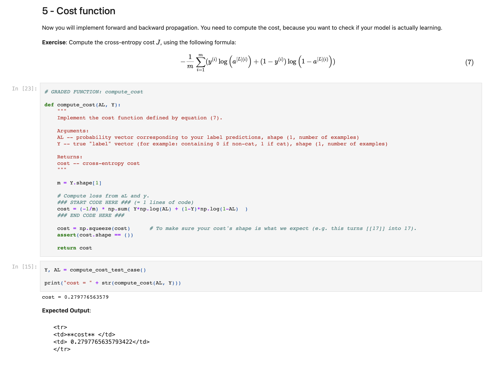

# My Completed Programming Assessments from Coursera Deep Learning Specialization.

Specialization Certificate:
 
https://www.coursera.org/account/accomplishments/specialization/4BMLTZ5RE42E

I took the Deep Learning Specialization by Andre NG on the Coursera Platform.

My university sponsored Coursera courses for a few months, I jumped at the chance and completed this specialization that had been under my care for a couple of time.

Personally, I really enjoy the programming assessments in Jupiter Notebooks.

The quality of these courses is very high, they contain very interesting lessons about Deep Learning Concepts in combination with powerful programming assessments to get hands-on experience and put in practice the important concepts.

### My Course Notes

<a href="https://drive.google.com/drive/folders/1rWlKXz5mQEmuN-QjGAPQ-dmpp1DXnv1G?usp=sharing" target="_blank">
Notes Course 1 & 2 : Neural Networks and Deep Learning / Hyperparameter tuning, regularization and optimization.
</a>

 
 

<a href="https://drive.google.com/drive/folders/10dbOMvje74JfD4h0Tf-uLWsumk7MHY5k?usp=sharing" target="_blank">Notes Course 3 : Structuring Machine Learning Projects (no labs, only theory course)
</a>
 
 
<a href="https://drive.google.com/drive/folders/1DeUCeB4aw0jRUWfui4bkXHRzjSEaaNYN?usp=sharing" target="_blank">
Notes Course 4 : Convolutional Neural Networks
</a>

<a href="" target="_blank">
Notes Course 5 : Sequence Models
</a>

## Favorite Coding Assignments

Building a Neural Network form Scratch:
<a href="https://github.com/Franklin098/DeepLearningSpecialization/blob/main/1%20Neural%20Networks%20and%20Deep%20Learning%20/4%20Deep%20Neural%20Network/Building_your_Deep_Neural_Network_Step_by_Step_v8a.ipynb" target="_blank">GitHub - Jupiter Notebook
</a>

Building a Convolutional Neural Network form Scratch:
<a href="https://github.com/Franklin098/DeepLearningSpecialization/blob/main/4%20Convolutional%20Neural%20Networks/1%20CNN%20from%20Scratch%20/Convolution_model_Step_by_Step_v2a.ipynb" target="_blank">GitHub - Jupiter Notebook
</a>

Image Style Transfer with a CNN:
<a href="https://github.com/Franklin098/DeepLearningSpecialization/blob/main/4%20Convolutional%20Neural%20Networks/Art%20Generation%20with%20Neural%20Style%20Transfer/Art_Generation_with_Neural_Style_Transfer_v3a.ipynb" target="_blank">GitHub - Jupiter Notebook
</a>
